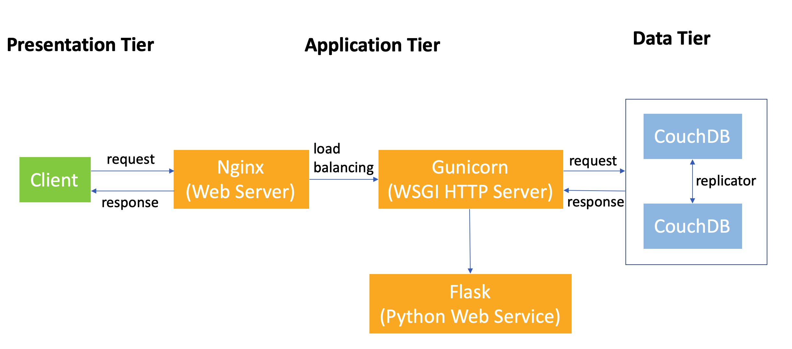

# visualisation-of-immigrant-Australian-population  
  
## Introduction  
Large data have brought opportunities and challenges for visualisation. This project presents a spatio-temporal visualisation of the immigrant Australian population in [an interactive web application](http://103.6.254.212/) combining technologies of NeCTAR research cloud, Docker, CouchDB, modern web framework, Ansible, etc.  
  
The visualisation results could intuitively answer questions such as 1) countries having obvious changes in the past 15 years, 2) the top sending countries and how they have changed, and 3) how the immigrant population will be in the near future.  
  
## System Design  
  
  
## Tech Stack  
### Frontend 
1. HTML5
2. CSS3
3. [ECharts](https://echarts.apache.org/en/index.html)
4. [D3.js](https://d3js.org/)
  
### Backend  
Flask  

### Database  
CouchDB  
  
### Deployment  
1. [NeCTAR research cloud](https://nectar.org.au/)
2. Docker
3. Ansible  

## Data Sources  
1. [Australian Bureau of Statistics (ABS)](https://www.abs.gov.au/)  
2. [Australian Urban Research Infrastructure Network (AURIN)](https://aurin.org.au/)